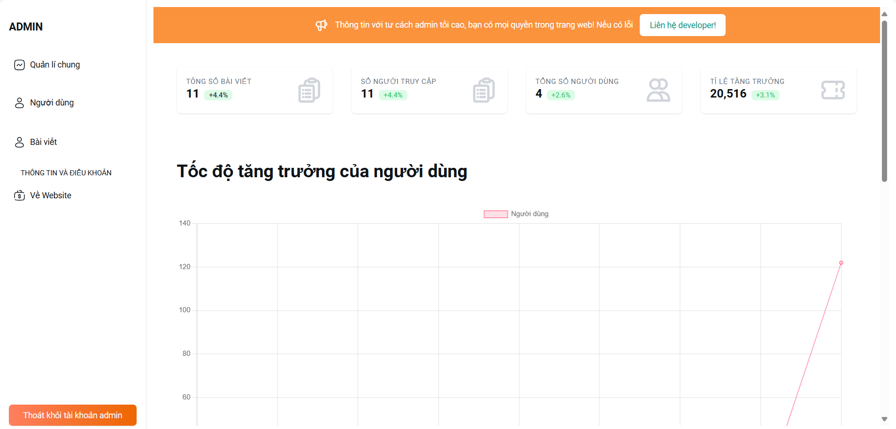
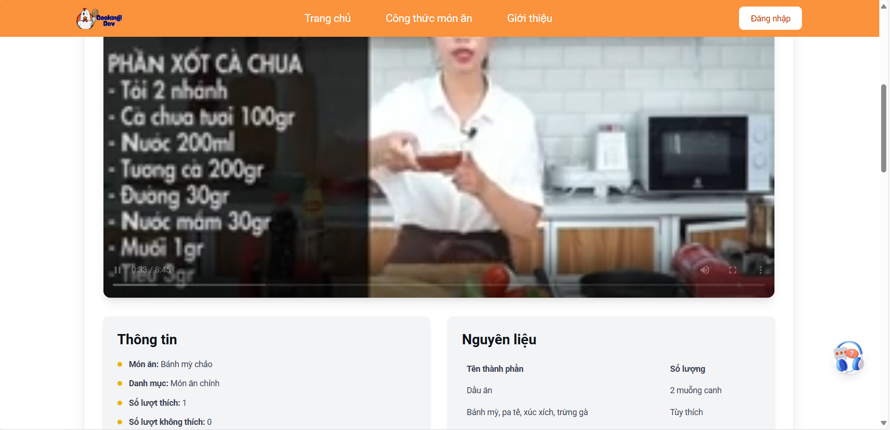
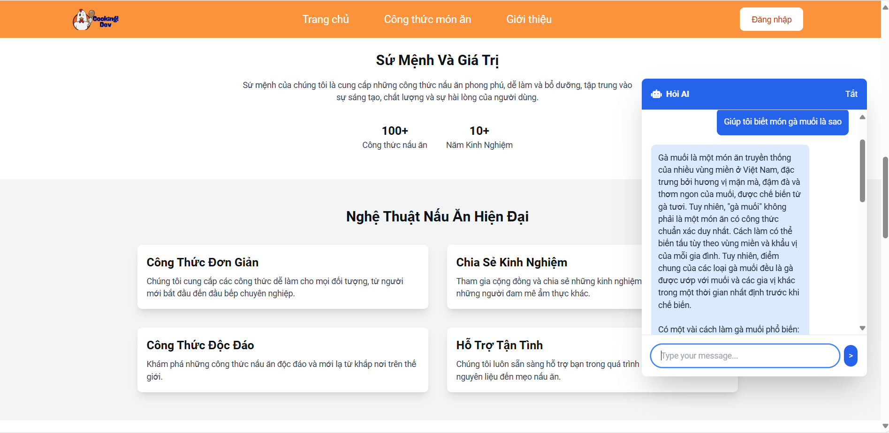
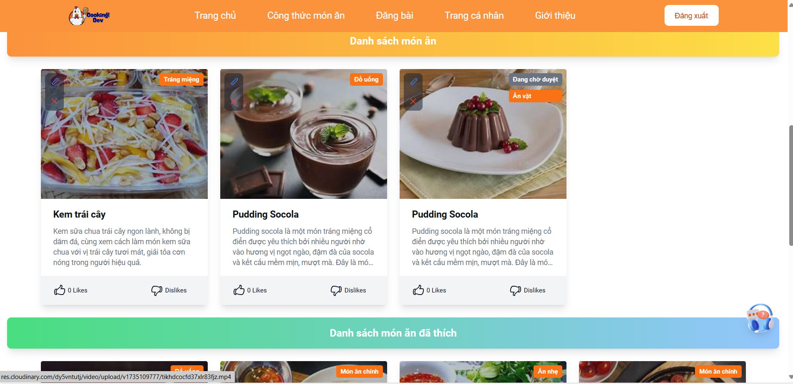

# CookDev

## Giới thiệu
CookDev là một nền tảng hỗ trợ nấu ăn thông minh, giúp người dùng khám phá công thức nấu ăn, quản lý nguyên liệu và trải nghiệm nấu ăn với AI.

## Công nghệ sử dụng

### Frontend
- **Vue.js** (Composition API)
- **TypeScript**
- **Tailwind CSS**

### Backend
- **Spring Boot**
- **REST API**
- **Cloud Storage** (Lưu trữ dữ liệu hiệu quả trên Cloud)

## Cài đặt

### Yêu cầu hệ thống
- **Node.js** (>= 16)
- **npm** hoặc **yarn**
- **Java** (>= 17)
- **Maven** hoặc **Gradle**

### Hướng dẫn chạy dự án

#### Frontend
```sh
# Clone repository
git clone https://github.com/minhduy6868/FE_Cooking_tutorial.git
cd FE_Cooking_tutorial

# Cài đặt dependencies
npm install  # hoặc yarn install

# Chạy dự án
npm run dev  # hoặc yarn dev
```

#### Backend
```sh
# Clone repository
git clone https://github.com/minhduy6868/BE_CookingTutorial_Web.git
cd BE_CookingTutorial_Web

# Build và chạy server
./mvnw spring-boot:run  # hoặc ./gradlew bootRun
```

## Ảnh màn hình

| Màn hình | Ảnh |
|----------|------|
| Quản trị |  ([Xem ảnh](public/admin.png)) |
| Đăng nhập |  ([Xem ảnh](public/login.png)) |
| Video |  ([Xem ảnh](public/video.png)) |
| AI hỗ trợ |  ([Xem ảnh](public/ai.png)) |
| Duyệt nội dung |  ([Xem ảnh](public/duyet.png)) |

## Đóng góp
Mọi đóng góp đều được hoan nghênh! Vui lòng tạo Pull Request hoặc mở Issue để báo lỗi và đề xuất cải tiến.

## Liên hệ
Website hỗ trợ: [minhduyy.id.vn](https://minhduyy.id.vn)

